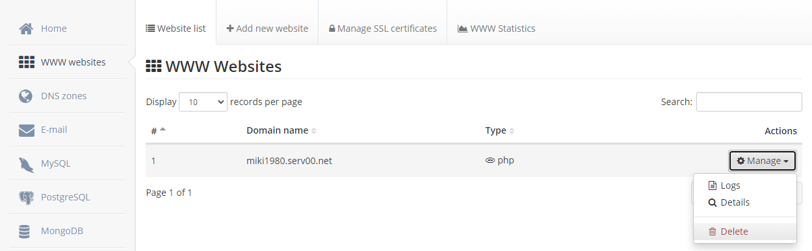
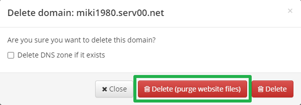
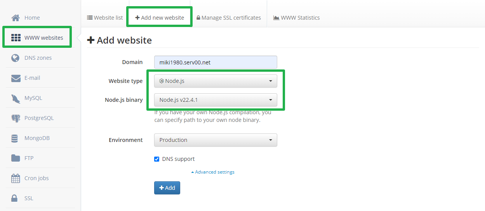
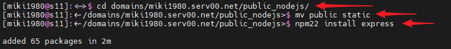
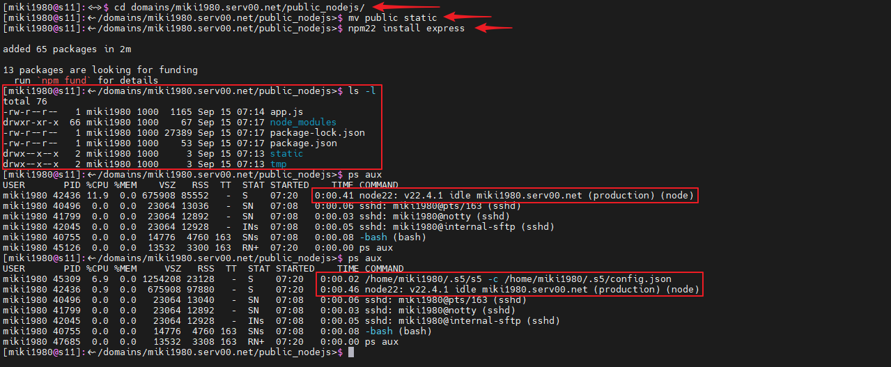
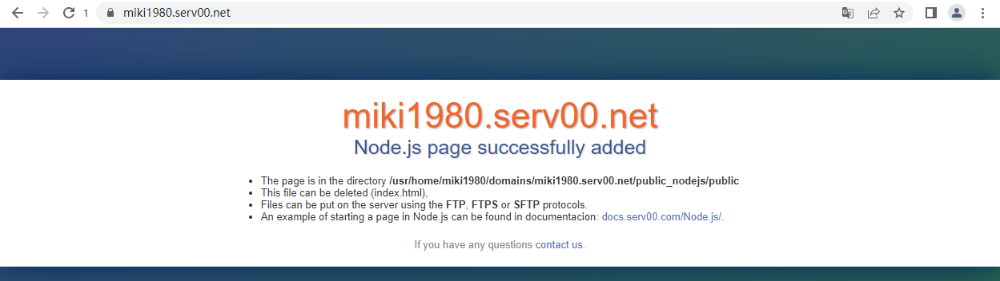
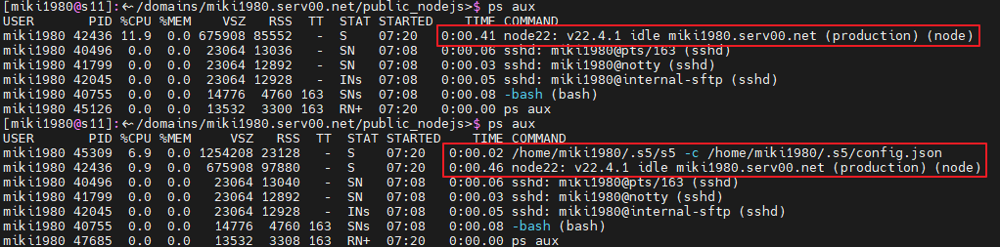

# Serv00服务器优雅的保活方案
本项目是在CMLiussss大佬的[博客](https://blog.cmliussss.com/p/Serv00-Socks5/)基础上对保活进行的改进，在部署前，请确保已经按博客内容完成了Socks5的部署并使用正常

在Serv00上使用Cron进行进程保活的情况下，发现Cron计划任务经常被清掉，导致进程存活时间很短，因而才有了这篇文章，对进程保活进行改进

这个方案利用了Serv00自带Apache服务器的Phusion Passenger插件功能，每次访问网页时可以唤醒Nodejs程序，因而不需要借助Cron就能够进行保活，自然没有了被杀Cron计划任务的烦扰

## 部署步骤
- 登录Serv00面板，删除注册后自带的网站 

- 点击Delete(purge website files)清空网站文件 

- 创建新网站，域名填写你想用的域名，我这里使用的是注册时自带的，网站类型设置为Node.js，程序版本选择NOde.js v22.4.1

- SSH登录Serv00，输入cd domains/你的网站域名/public_nodejs/
- 由于Serv00的Apache设置的是静态优先，因而此处public文件夹下不能有index.html，否则会显示静态页面，而不会执行nodejs程序，我选择的是直接将public改名为static，执行mv public static
- 执行npm22 install express

- 修改app.js的第7行，填写你自己的Serv00用户名，再将app.js上传到服务器，完整路径是/home/你的用户名/domains/你的网站域名/public_nodejs/，修改完成后public_nodejs目录下应该和我一样

- 自此部署完成

## 测试
- 用浏览器输入一下你创建的网站域名，正常就能看到默认的页面

- 页面能够正常显示，返回SSH终端，输入ps aux可以看到新开了nodejs进程，稍带片刻，就能看到你的代理进程成功启动了

- Nodejs程序运行日志可以通过面板网站的log中查看，也可以在SSH终端里查看，日志文件的完整路径为/home/你的用户名/domains/你的网站域名/logs/error.log

## 后续
- Nodejs进程的保活，可以手动访问网站进行，也可以通过自动化方案监控网站进行，就不再赘述了
- 自动化的我推荐[upptime](https://github.com/upptime/upptime)，不需要有服务器，只需要有Github账号就能够进行部署
- 完结撒花~~
